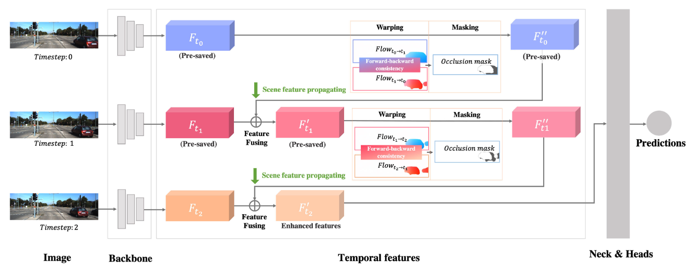

# TempM3D: Temporal Feature Fusion for 3D Detection in Monocular Video

*Note that this is an initial version; this repository needs to be further cleaned and refactored.*



**Paper link:** [Temporal Feature Fusion for 3D Detection in Monocular Video](https://scholar.google.com/scholar?oi=bibs&cluster=6723690496893990047&btnI=1&hl=zh-CN)

**Abstract:** Previous monocular 3D detection works focus on the single frame input in both training and inference. In realworld applications, temporal and motion information naturally exists in monocular video. It is valuable for 3D detection but under-explored in monocular works. In this paper, we propose a straightforward and effective method for temporal feature fusion, which exhibits low computation cost and excellent transferability, making it conveniently applicable to various monocular models. Specifically, with the help of optical flow, we transform the backbone features produced by prior frames and fuse them into the current frame. We introduce the scene feature propagating mechanism, which accumulates history scene features without extra time-consuming. In this process, occluded areas are removed via forward-backward scene consistency. Our method naturally introduces valuable temporal features, facilitating 3D reasoning in monocular 3D detection. Furthermore, accumulated history scene features via scene propagating mitigate heavy computation overheads for video processing. Experiments are conducted on variant baselines, which demonstrate that the proposed method is model-agonistic and can bring significant improvement to multiple types of single-frame methods.


## Installation Steps

a. Clone this repository.

b. Install the dependent libraries as follows:

- Install the dependent python libraries:

  ```
  pip install torch==1.10.0 torchvision==0.11.1 pyyaml scikit-image opencv-python numba tqdm
  ```

- We test this repository on Nvidia 3080Ti GPUs and Ubuntu 18.04. You can also follow the install instructions in [GUPNet](https://github.com/SuperMHP/GUPNet) (This respository is based on it) to perform experiments with lower PyTorch/GPU versions.


## Getting Started

### Dataset Preparation

- Please download the official [KITTI 3D object detection](http://www.cvlibs.net/datasets/kitti/eval_object.php?obj_benchmark=3d) dataset and organize the downloaded files as follows:

```
DID-M3D
├── data
│   │── KITTI3D
|   │   │── training
|   │   │   ├──calib & label_2 & image_2 & depth_dense
|   │   │── testing
|   │   │   ├──calib & image_2
├── config
├── ...
```

- You can also choose to link your KITTI dataset path by

  ```
  KITTI_DATA_PATH=~/data/kitti_object
  ln -s $KITTI_DATA_PATH ./data/KITTI3D
  ```

- To ease the usage, we provide the pre-generated dense depth files at: [Google Drive](https://drive.google.com/file/d/1mlHtG8ZXLfjm0lSpUOXHulGF9fsthRtM/view?usp=sharing)

### Training & Testing

We provide an implementation based on DID-M3D in this method.

#### Test and evaluate the pre-trained models

```
CUDA_VISIBLE_DEVICES=0 python tools/train_val.py --config experiments/kitti.yaml -e   
```

#### Train a model

```
CUDA_VISIBLE_DEVICES=0,1,2,3 python tools/train_val.py --config config/kitti.yaml
```


## Citation

```
@article{cheng2024temporal,
  title={Temporal Feature Fusion for 3D Detection in Monocular Video},
  author={Cheng, Haoran and Peng, Liang and Yang, Zheng and Lin, Binbin and He, Xiaofei and Wu, Boxi},
  journal={IEEE Transactions on Image Processing},
  year={2024},
  publisher={IEEE}
}
```


## Acknowledgements

This respository is mainly based on [DID-M3D](https://github.com/SPengLiang/DID-M3D), and it also benefits from [MonoNeRD](https://github.com/cskkxjk/MonoNeRD). Thanks for their great works!